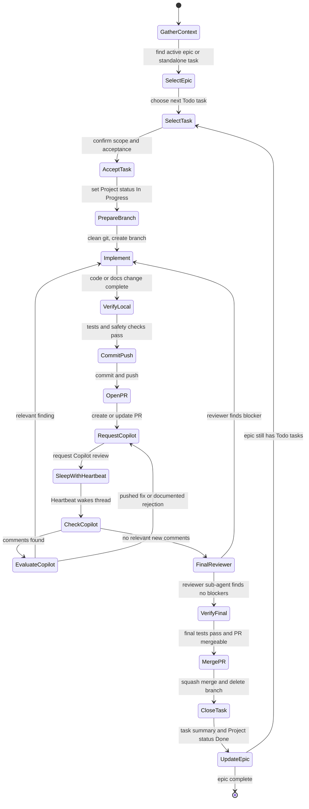
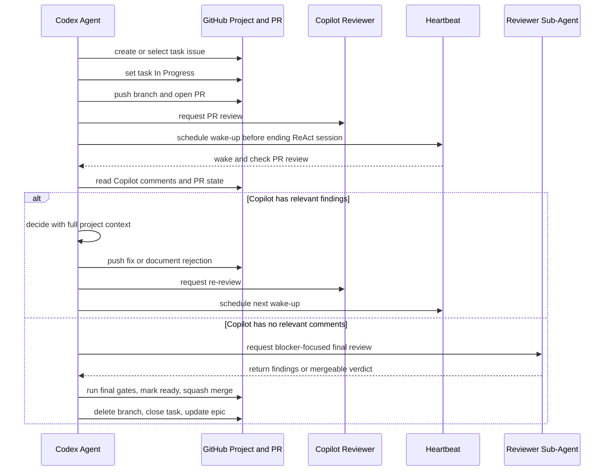
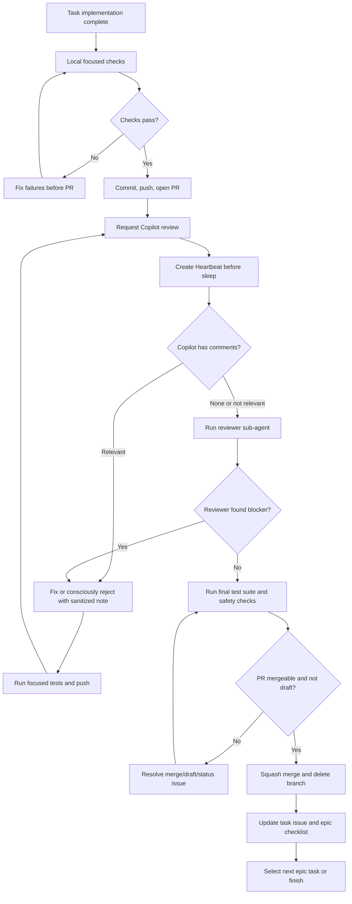

# Agent Dev Pipeline Contract

This contract describes the public, environment-obfuscated workflow for Codex-like agents working on Aigan. Its goal is to let an agent carry a task from epic selection to merge and project bookkeeping without requiring a human to sit beside every wait state.

Private runtime details, host aliases, local paths, MCP endpoints, logs, databases, media caches, secrets, and raw chat text must stay out of this file, GitHub issues, PRs, commits, and public handoffs.

## Operating Rules

- Start from a GitHub issue. Use `[DEV]` for developer workflow, automation, and agent-process contract work.
- Keep `AGENTS.md` as the concise entrypoint and use this file for the detailed pipeline.
- Before implementation, move the task Project status to `In Progress`; new planning work starts as `Todo`.
- Work on a task branch, commit intentional changes, push, and open a PR.
- Request Copilot review on the PR. Treat Copilot as a dry code reviewer: useful for code-level risk, not a context owner and not an approval authority.
- Before ending a ReAct session while waiting on Copilot, CI, deploy validation, another agent, or an external reviewer, create a Heartbeat follow-up for the current thread.
- If Copilot comments, evaluate each point with full project context. Fix relevant issues; briefly document intentionally rejected or non-actionable suggestions when useful.
- Re-request Copilot review after pushing review fixes and create another Heartbeat before sleeping again.
- When Copilot has no relevant new comments, spawn or ask a reviewer sub-agent for a final blocker-focused pass, then run the final tests.
- Mark the PR ready only after the final gates pass. Squash merge, delete the branch, close/update the task issue, and update the parent epic checklist when applicable.

## Epic Task State Machine

## Review And Heartbeat Sequence

## Merge Gate Flow

## Handoff Checklist

- Current task issue and Project status are named.
- Branch, PR number, latest commit, and test status are named.
- Heartbeat is scheduled for any wait state before the agent stops.
- Copilot comments are classified as relevant, not relevant, duplicate, or already fixed.
- Final reviewer sub-agent verdict is recorded before merge.
- Task issue gets a concise completion note with important pitfalls, decisions, and verification.
- Parent epic checklist is updated after task completion when a parent epic exists.

## References

- AGENTS.md format: https://github.com/agentsmd/agents.md
- Custom instruction guidance: https://code.visualstudio.com/docs/copilot/customization/custom-instructions
- Copilot code review: https://docs.github.com/en/copilot/how-tos/use-copilot-agents/request-a-code-review/use-code-review?tool=visualstudio
- Mermaid state diagrams: https://mermaid.js.org/syntax/stateDiagram
