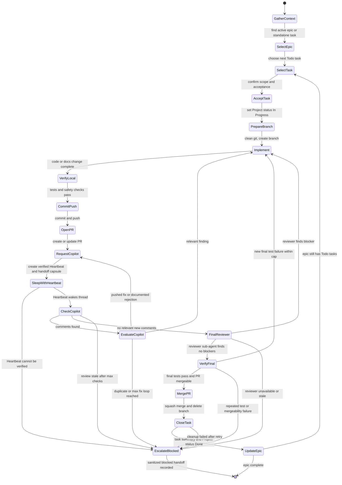
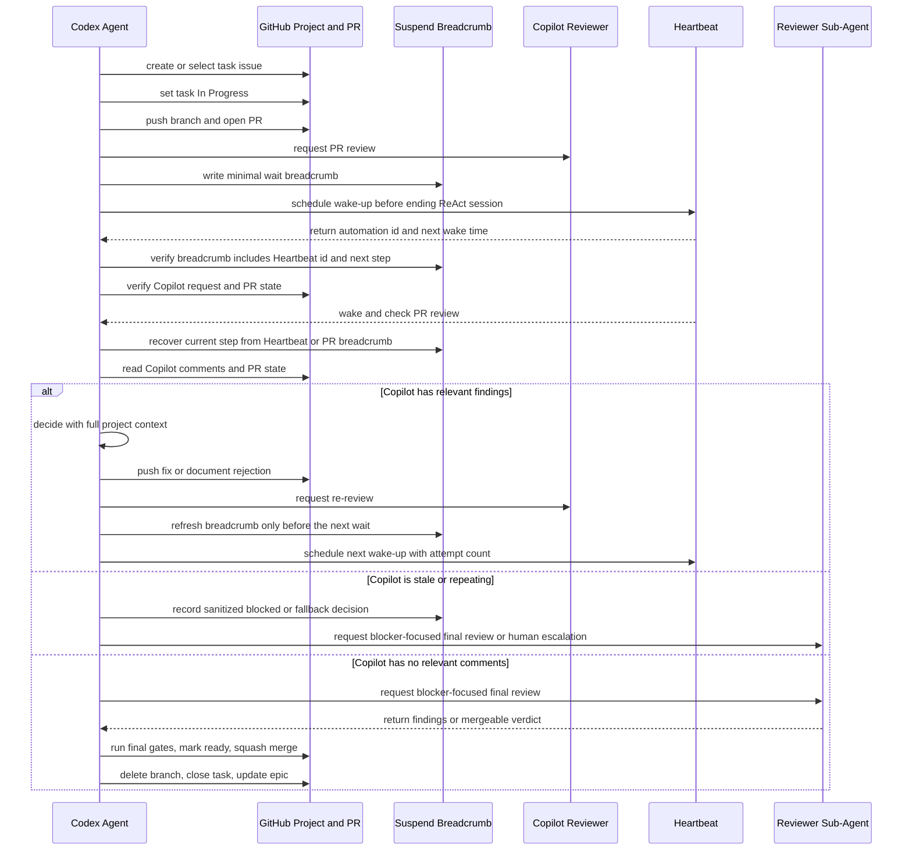
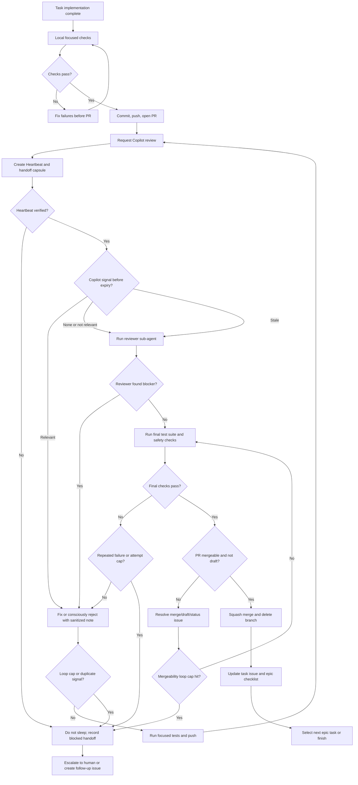

# Agent Dev Pipeline Contract

This contract describes the public, environment-obfuscated workflow for Codex-like agents working on Aigan. Its goal is to let an agent carry a task from epic selection to merge and project bookkeeping without requiring a human to sit beside every wait state.

Private runtime details, host aliases, local paths, MCP endpoints, logs, databases, media caches, secrets, and raw chat text must stay out of this file, GitHub issues, PRs, commits, and public handoffs.

## Operating Rules

- Start from a GitHub issue. Use the implementing agent's normal prefix for pipeline tasks, for example `[codex]` for Codex-owned work. Reserve `[DEV]` for this pipeline contract and closely related contract-maintenance issues only.
- Keep `AGENTS.md` as the concise entrypoint and use this file for the detailed pipeline.
- Before implementation, move the task Project status to `In Progress`; new planning work starts as `Todo`.
- Work on a task branch, commit intentional changes, push, and open a PR.
- Request Copilot review on the PR. Treat Copilot as a dry code reviewer: useful for code-level risk, not a context owner and not an approval authority.
- Before ending a ReAct session while waiting on Copilot, CI, deploy validation, another agent, or an external reviewer, create and verify a Heartbeat follow-up for the current thread.
- Every wait state must name the owner, target URL or issue/PR number, branch, latest commit, wait reason, next wake time, maximum checks, expiry action, and current fallback.
- The current thread context is the normal continuity layer, but external waits still need a minimal suspend/resume breadcrumb. Do not rely on process memory, global variables, environment variables, or local files as the only record of what to do after wake-up.
- A per-run pipeline live file is allowed only as an untracked private cache. It must never contain secrets or private runtime details and must not be required for recovery.
- The Heartbeat prompt must point to this contract and include enough issue/PR metadata for the next session to identify the current step. Vague wake-up prompts such as "check later" are not valid handoffs.
- If Copilot comments, evaluate each point with full project context. Fix relevant issues; briefly document intentionally rejected or non-actionable suggestions when useful.
- Re-request Copilot review after pushing review fixes and create another Heartbeat before sleeping again.
- When Copilot has no relevant new comments, spawn or ask a reviewer sub-agent for a final blocker-focused pass, then run the final tests.
- Mark the PR ready only after the final gates pass. Squash merge, delete the branch, close/update the task issue, and update the parent epic checklist when applicable.
- No loop may return to the same state without new evidence. Repeated comments, repeated test failures, stale CI, missing reviewer response, or mergeability that stays blocked must hit a cap and escalate instead of spinning forever.

## Epic Task State Machine



## Review And Heartbeat Sequence



## Merge Gate Flow



## Liveness And Loop Guards

- A Heartbeat is valid only after the agent has the automation id, target thread, next wake time, and self-contained prompt. If this cannot be verified, the agent must not end the ReAct session as if the wait is covered.
- A handoff capsule must be durable and sanitized. Put it in the PR or task issue when useful, and include issue number, PR number, branch, latest commit, check results, reviewer state, wait owner, and next expected action.
- Each wait loop needs a maximum check count and an expiry action. Suggested defaults: Copilot review `3` checks, CI `6` checks, deploy validation `3` checks, reviewer sub-agent `2` checks.
- Each fix loop needs a maximum attempt count. Suggested defaults: Copilot fix loop `3` relevant iterations, focused test loop `3` attempts, mergeability loop `2` attempts.
- Duplicate or stale signals must be detected by a stable key such as review comment URL, file path and line, check name, failure signature, or sanitized error class.
- A loop is stale when the same state repeats without a new commit, new reviewer signal, changed check result, changed failure signature, or changed mergeability reason.
- If a loop expires, record a sanitized blocked handoff and either escalate to a human, create a follow-up issue, or continue with an explicitly named fallback path.
- Reviewer sub-agents are also external wait states. Before sleeping on them, create a Heartbeat or keep the current ReAct session open until they return.
- Cleanup after merge is bounded. If branch deletion, issue update, or epic checklist update fails after one retry, record the failure and move to a follow-up instead of blocking the next task forever.

## Suspend/Resume Breadcrumbs

Do not build a second workflow engine in project comments. Codex Heartbeats normally wake the same thread, so the chat context remains the primary continuity layer. The breadcrumb is a small insurance policy for suspend points, context compaction, stale waits, or another agent picking up the PR.

- Write a breadcrumb only before a real wait or handoff: Copilot, CI, deploy validation, reviewer sub-agent, external reviewer, human approval, or a blocked state.
- The Heartbeat prompt is the first breadcrumb. It must include the automation id, issue or PR number, branch, latest commit, current state, `NEXT_STEP`, wait owner, wait cap, and fallback.
- Add a PR or issue breadcrumb comment only when the wait is long, risky, already stale, crosses agents, changes reviewer ownership, or follows a new commit that materially changes the next action.
- Do not update breadcrumbs after every normal side effect. The next session should verify GitHub state first and treat repeated actions as idempotent.
- Do not advance `NEXT_STEP` before the side effect that justifies the advance has actually succeeded.
- A local live file is optional private scratch. It can speed up same-machine recovery, but the Heartbeat and PR or issue context must be enough when the file is missing.
- Never store raw prompts, private chat text, secrets, local hostnames, private paths, database or media paths, token-like strings, or raw logs in breadcrumbs.

Example public-safe breadcrumb:

```yaml
schema: agent-suspend-breadcrumb/v1
run_id: issue-31-pr-32
contract: AGENTS.dev-pipeline-contract.md
issue: 31
pr: 32
branch: VIT/codex/example-task
head_sha: abc1234
state: waiting_for_copilot
NEXT_STEP: check_copilot_review
heartbeat_id: check-copilot-review-for-pr-32
wait_owner: copilot
wait_reason: review requested after latest push
attempts:
  copilot_checks: 1
limits:
  copilot_checks: 3
expires_utc: 2026-05-15T22:00:00Z
fallback: run_reviewer_subagent_or_escalate
evidence:
  latest_commit: abc1234
  last_checks: docs_safety_green
  copilot_status: requested
safety: sanitized_no_private_runtime_details
```

Wake-up recovery algorithm:

1. Read the Heartbeat instructions and recover the automation id, issue or PR number, branch, latest commit, and `NEXT_STEP`.
2. Use the current thread context first. If context is compressed or ambiguous, read the latest PR or issue breadcrumb comment.
3. Fetch GitHub state, then verify branch, head commit, PR status, review status, checks, and project item status before acting.
4. Execute only the named `NEXT_STEP`, and make it idempotent by checking whether the intended side effect already happened.
5. If another wait is needed, refresh the Heartbeat breadcrumb and add or update a PR/issue breadcrumb only when the handoff is risky enough to deserve durable notes.
6. If the Heartbeat and GitHub evidence disagree and the agent cannot reconcile them, record a sanitized blocked handoff instead of sleeping again.
7. If the task is complete, delete obsolete Heartbeats, mark Project status and issue state, and write a concise sanitized completion note.

## Pipeline Test Matrix

- Heartbeat creation fails: agent records a blocked handoff and does not sleep silently.
- Heartbeat wakes after context compaction: the Heartbeat breadcrumb plus GitHub PR/issue state is sufficient to recover issue, PR, branch, commit, and next action.
- Heartbeat wakes with no readable PR/issue breadcrumb: agent uses the Heartbeat and GitHub evidence, then escalates only if the next step is still ambiguous.
- Heartbeat prompt and PR/issue evidence disagree on `NEXT_STEP`: agent reconciles from GitHub evidence or escalates.
- A side effect succeeds but the wait breadcrumb cannot be refreshed before sleeping: agent records a blocked handoff or keeps working instead of creating an ambiguous wait.
- Copilot is requested but silent past the max checks: agent runs the fallback reviewer path or escalates.
- Copilot repeats the same irrelevant comment: agent classifies it as duplicate or not relevant and exits the Copilot loop.
- Copilot repeats a relevant finding after repeated fixes: agent escalates with the latest failure signature instead of editing forever.
- Focused tests fail with the same signature more than the attempt cap: agent stops the loop and records the blocker.
- CI stays pending or unavailable beyond expiry: agent records the stale check and follows the configured fallback.
- Reviewer sub-agent is unavailable or returns no verdict: agent uses the wait cap and escalates rather than sleeping forever.
- PR mergeability stays blocked after bounded retries: agent records the merge blocker and stops the merge loop.
- Project item or epic checklist update fails after merge: agent records the bookkeeping follow-up and does not reopen completed code work.

## Handoff Checklist

- Current task issue and Project status are named.
- Branch, PR number, latest commit, and test status are named.
- Current suspend breadcrumb and `NEXT_STEP` are named for any wait handoff.
- Heartbeat is scheduled and verified for any wait state before the agent stops.
- Wait owner, max checks, expiry action, and fallback are named.
- Copilot comments are classified as relevant, not relevant, duplicate, or already fixed.
- Final reviewer sub-agent verdict is recorded before merge.
- Task issue gets a concise completion note with important pitfalls, decisions, and verification.
- Parent epic checklist is updated after task completion when a parent epic exists.

## References

- AGENTS.md format: https://github.com/agentsmd/agents.md
- Custom instruction guidance: https://code.visualstudio.com/docs/copilot/customization/custom-instructions
- Copilot code review: https://docs.github.com/en/copilot/how-tos/use-copilot-agents/request-a-code-review/use-code-review?tool=visualstudio
- Mermaid state diagrams: https://mermaid.js.org/syntax/stateDiagram
- AWS timeout guidance for agentic workflows: https://docs.aws.amazon.com/wellarchitected/latest/generative-ai-lens/genrel03-bp02.html
- AWS Durable Execution determinism guidance: https://docs.aws.amazon.com/durable-execution/patterns/best-practices/determinism/
- LangGraph interrupt and resume patterns: https://docs.langchain.com/oss/python/langgraph/interrupts
- LangGraph persistence and checkpointing: https://docs.langchain.com/oss/javascript/langgraph/persistence
- Microsoft Agent Framework checkpoints: https://learn.microsoft.com/en-us/agent-framework/workflows/checkpoints
- Azure Durable Task replay constraints: https://learn.microsoft.com/en-us/azure/azure-functions/durable/durable-functions-code-constraints
- Temporal durable execution: https://docs.temporal.io/
- AutoGen termination and handoff patterns: https://microsoft.github.io/autogen/stable/user-guide/agentchat-user-guide/tutorial/human-in-the-loop.html
- Community loop-closure discussion: https://www.reddit.com/r/LLMDevs/comments/1su80un/closing_the_loop/
- Community autonomous-agent failure discussion: https://www.reddit.com/r/AI_Agents/comments/1sqi8r3/what_actually_breaks_when_you_move_from/
