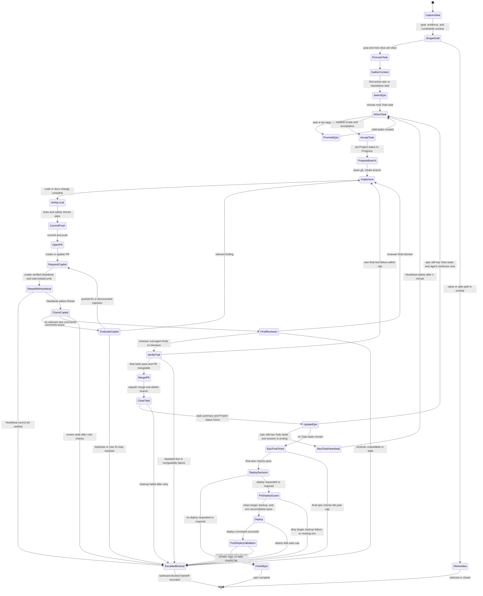
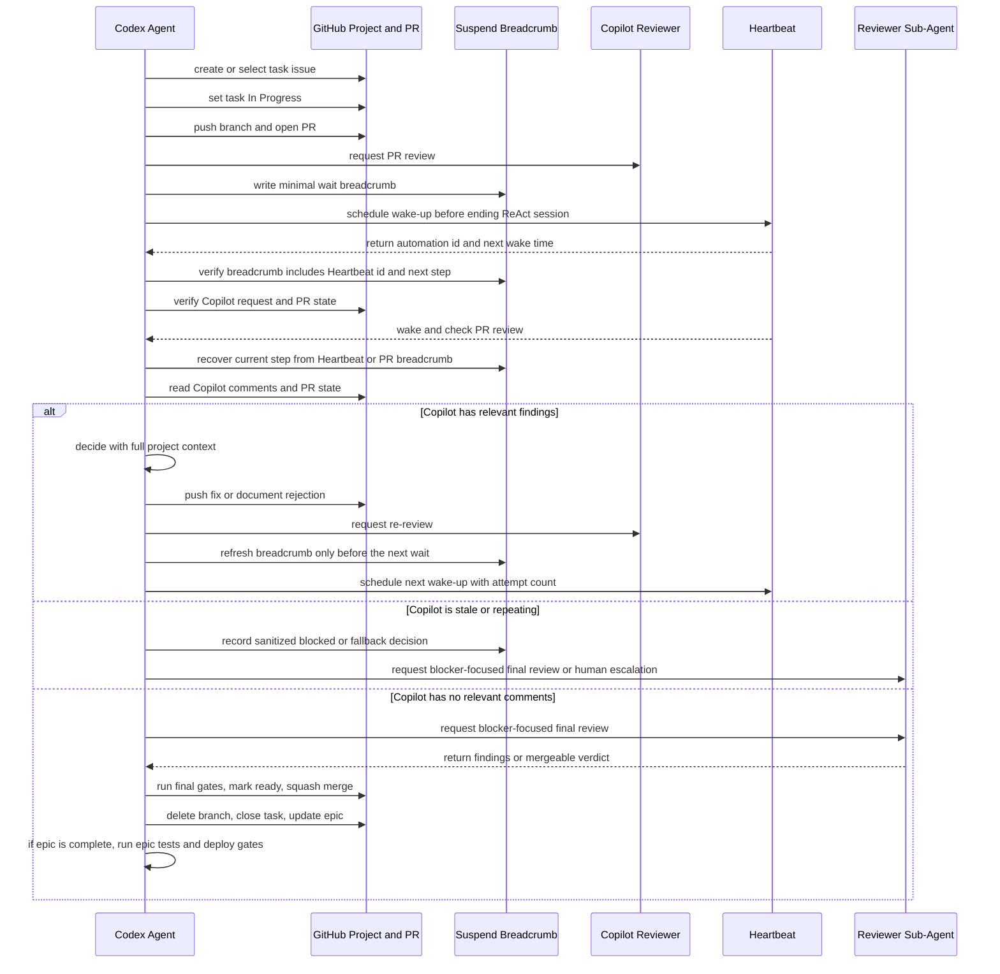
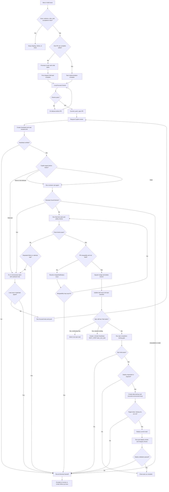

# Agent Dev Pipeline Contract

This contract describes the public, environment-obfuscated workflow for Codex-like agents working on Aigan. Its goal is to let an agent carry a task from epic selection to merge and project bookkeeping without requiring a human to sit beside every wait state.

Private runtime details, host aliases, local paths, MCP endpoints, logs, databases, media caches, secrets, and raw chat text must stay out of this file, GitHub issues, PRs, commits, and public handoffs.

## Discovery And Shaping Gate

- Use GitHub issues as the durable scratchpad for long-running discovery. Record sanitized facts, rejected paths, external references, code/runtime evidence, and goal changes as the idea matures.
- A raw idea may stay as a draft or planning issue while the goal is unclear. Do not start implementation only because an issue exists.
- Before promoting a draft to a task, state the goal, non-goals, evidence, one concrete next slice, acceptance checks, safety constraints, and expected value/cost. If the goal cannot be stated, shelve or keep shaping.
- Before promoting a task to an epic, verify that the work cannot be completed safely in one PR and has independent child slices, staged research/implementation/deploy work, cross-subsystem risk, durable data or contract impact, or epic-level testing/deploy gates.
- Do not promote when the work is mostly speculation, a grab-bag of nice-to-haves, or smaller than the process it would create. Prefer the smallest issue shape that reduces risk and preserves context.
- A shaped task or epic should be rough enough to leave implementation freedom, solved enough to avoid blind coding, and bounded enough to name risks, rabbit holes, no-gos, and validation.

## Operating Rules

- Start from a GitHub issue. Use the implementing agent's normal prefix for pipeline tasks, for example `[codex]` for Codex-owned work. Reserve `[DEV]` for this pipeline contract and closely related contract-maintenance issues only.
- Keep `AGENTS.md` as the concise entrypoint and use this file for the detailed pipeline.
- For `[DEV]` contract-maintenance work, follow the stable contract as it existed before the current change. Do not recursively apply rules that are being added or edited in the same PR.
- Before implementation, move the task Project status to `In Progress`; new planning work starts as `Todo`.
- Work on a task branch, commit intentional changes, push, and open a PR.
- Request Copilot review on the PR. Treat Copilot as a dry code reviewer: useful for code-level risk, not a context owner and not an approval authority.
- Before ending a ReAct session while waiting on Copilot, CI, deploy validation, another agent, or an external reviewer, create and verify a Heartbeat follow-up for the current thread.
- Every wait state must name the owner, issue or PR, branch, latest commit, `NEXT_STEP`, maximum checks, expiry action, and fallback.
- Use a compact suspend/resume breadcrumb only at wait or handoff boundaries.
- If Copilot comments, evaluate each point with full project context. Fix relevant issues; briefly document intentionally rejected or non-actionable suggestions when useful.
- Re-request Copilot review after pushing review fixes and create another Heartbeat before sleeping again.
- When Copilot has no relevant new comments, spawn or ask a reviewer sub-agent for a final blocker-focused pass, then run the final tests.
- Mark the PR ready only after the final gates pass. Squash merge, delete the branch, close/update the task issue, and update the parent epic checklist when applicable.
- For model or tool flows that mutate durable state, enforce a postcondition check: user-facing claims such as created, remembered, updated, canceled, deleted, scheduled, or saved are valid only after a successful tool result or persisted-state verification. If no mutation succeeded, the model must clarify instead of claiming success.
- After a task is closed, if the parent epic still has `Todo` child issues, either continue to the next task immediately or create a 1-minute Heartbeat with `NEXT_STEP=start_next_task` before ending the ReAct session.
- When the last child task of an epic is closed, run the epic completion testing gate before declaring the epic complete.
- Deploy only after the deploy gate passes: tests are green, bookkeeping is complete, the target worktree is clean, persistent data is backed up, required environment keys are reconciled, and post-deploy validation has a named fallback.
- Each loop needs new evidence. Repeated comments, repeated test failures, stale CI, missing reviewer response, or unchanged merge blockers must hit a cap and escalate.

## Epic Task State Machine

## Review And Heartbeat Sequence

## Merge Gate Flow

## Epic Testing And Deploy Gates

- The task-level final checks prove the PR is mergeable. The epic-level final checks prove the full accumulated epic is releasable.
- At the end of an epic, verify GitHub state first: all child issues closed or Done, parent checklist complete, all PRs merged, local `main` synced to remote `main`, and no intended change left unmerged.
- Run fast local checks when the local environment is meaningful. If local data, dependencies, or runtime state are not representative, treat local checks as advisory and run authoritative checks in the configured production-like environment from private operator context.
- The minimum generic epic gate is: focused feature checks where applicable, full test suite, Docker build, Docker test run when Docker is part of deployment, `git diff --check`, sanitized grep over public diffs, and a final reviewer verdict for any late deploy/test edits.
- A deploy target must be clean before mutation. Dirty tracked files, untracked code, unknown artifacts, missing secrets, or unclear runtime state block deploy. Do not stash, reset, overwrite, delete, or migrate unknown live state automatically.
- Before live tests or deploy, create a backup of persistent data and capture sanitized baseline facts such as durable table counts, artifact counts/sizes, target commit, service status, and expected environment key names.
- Reconcile environment keys before deploy. Add safe non-secret defaults when the release expects them; block and ask for any required secret or value whose safe default is unknown. Never print environment values.
- Post-deploy validation must verify the deployed commit, service status, recent sanitized logs, admin diagnostics, feature-specific smoke tests, and persistent data integrity against the pre-deploy baseline.
- If post-deploy validation requires waiting, create a Heartbeat with `NEXT_STEP=check_deploy_validation`, target commit, wait owner, wait count, wait limit, validation status, rollback or block fallback, and sanitized notes.
- If unexpected data loss, artifact loss, repeated smoke failure, or unclear runtime drift appears, stop the deploy loop, preserve evidence privately, restore from backup only when the restore path is understood, and create a revised deploy plan.

## Liveness And Loop Guards

- A Heartbeat is valid only after the agent has the automation id, target thread, next wake time, and self-contained prompt.
- A wait breadcrumb must be sanitized and include issue or PR, branch, latest commit, check state, reviewer state, wait owner, and next expected action.
- Each wait loop needs a maximum check count and an expiry action. Suggested defaults: Copilot review `3` checks, CI `6` checks, deploy validation `3` checks, reviewer sub-agent `2` checks.
- Each fix loop needs a maximum attempt count. Suggested defaults: Copilot fix loop `3` relevant iterations, focused test loop `3` attempts, mergeability loop `2` attempts.
- Duplicate or stale signals must be detected by a stable key such as review comment URL, file path and line, check name, failure signature, or sanitized error class.
- A loop is stale when the same state repeats without a new commit, new reviewer signal, changed check result, changed failure signature, or changed mergeability reason.
- If a loop expires, record a sanitized blocked handoff and either escalate to a human, create a follow-up issue, or continue with an explicitly named fallback path.
- Reviewer sub-agents are also external wait states. Before sleeping on them, create a Heartbeat or keep the current ReAct session open until they return.
- Cleanup after merge is bounded. If branch deletion, issue update, or epic checklist update fails after one retry, record the failure and move to a follow-up instead of blocking the next task forever.
- The next-task Heartbeat is required only when the agent is about to stop while the parent epic still has `Todo` tasks. Use a 1-minute interval and `NEXT_STEP=start_next_task`.

## Suspend/Resume Breadcrumbs

- Write a breadcrumb only before a real wait or handoff: Copilot, CI, deploy validation, reviewer sub-agent, external reviewer, human approval, or a blocked state.
- The Heartbeat prompt is the first breadcrumb. Include the automation id, issue or PR number, branch, latest commit, current state, `NEXT_STEP`, wait owner, wait cap, and fallback.
- Add a PR or issue breadcrumb comment only when the wait is long, risky, already stale, crosses agents, changes reviewer ownership, or follows a new commit that materially changes the next action.
- On wake, verify GitHub state before acting and treat repeated actions as idempotent.
- Advance `NEXT_STEP` only after the side effect that justifies the advance has succeeded.
- A local live file is optional private scratch. It can speed up same-machine recovery, but the Heartbeat and PR or issue context must be enough when the file is missing.
- Keep breadcrumbs free of raw prompts, private chat text, secrets, local hostnames, private paths, database or media paths, token-like strings, and raw logs.

For durable PR or issue breadcrumbs, include: `automation_id`, `issue` or `pr`, `branch`, `head_sha`, `state`, `NEXT_STEP`, `wait_owner`, `wait_count`, `wait_limit`, `fallback`, and latest check or reviewer status. Short waits can rely on the Heartbeat prompt.

Wake-up recovery algorithm:

1. Read the Heartbeat instructions and recover the automation id, issue or PR number, branch, latest commit, and `NEXT_STEP`.
2. Use the current thread context first. If context is compressed or ambiguous, read the latest PR or issue breadcrumb comment.
3. Fetch GitHub state, then verify branch, head commit, PR status, review status, checks, and project item status before acting.
4. Execute only the named `NEXT_STEP`, and make it idempotent by checking whether the intended side effect already happened.
5. If another wait is needed, refresh the Heartbeat breadcrumb and add or update a PR/issue breadcrumb only when the handoff is risky enough to deserve durable notes.
6. If the Heartbeat and GitHub evidence disagree and the agent cannot reconcile them, record a sanitized blocked handoff instead of sleeping again.
7. If the task is complete, delete obsolete Heartbeats, mark Project status and issue state, and write a concise sanitized completion note.

## Pipeline Test Matrix

- Draft lacks a clear goal, evidence, or acceptance: agent keeps it in discovery instead of implementing.
- A draft has a clear goal and one bounded slice: agent promotes it to a task, not an epic.
- A task has multiple independent slices or epic-level deploy risk: agent promotes or splits it before implementation.
- A task is small enough for one PR: agent does not promote it just to satisfy process.
- Heartbeat creation fails: agent records a blocked handoff and does not sleep silently.
- Heartbeat wakes after context compaction: the Heartbeat breadcrumb plus GitHub PR/issue state is sufficient to recover issue, PR, branch, commit, and next action.
- Heartbeat wakes with no readable PR/issue breadcrumb: agent uses the Heartbeat and GitHub evidence, then escalates only if the next step is still ambiguous.
- Heartbeat prompt and PR/issue evidence disagree on `NEXT_STEP`: agent reconciles from GitHub evidence or escalates.
- A side effect succeeds but the wait breadcrumb cannot be refreshed before sleeping: agent records a blocked handoff or keeps working instead of creating an ambiguous wait.
- A task closes while its parent epic still has Todo tasks: agent either starts the next task immediately or schedules a 1-minute `NEXT_STEP=start_next_task` Heartbeat.
- Copilot is requested but silent past the max checks: agent runs the fallback reviewer path or escalates.
- Copilot repeats the same irrelevant comment: agent classifies it as duplicate or not relevant and exits the Copilot loop.
- Copilot repeats a relevant finding after repeated fixes: agent escalates with the latest failure signature instead of editing forever.
- Focused tests fail with the same signature more than the attempt cap: agent stops the loop and records the blocker.
- CI stays pending or unavailable beyond expiry: agent records the stale check and follows the configured fallback.
- Reviewer sub-agent is unavailable or returns no verdict: agent uses the wait cap and escalates rather than sleeping forever.
- PR mergeability stays blocked after bounded retries: agent records the merge blocker and stops the merge loop.
- Project item or epic checklist update fails after merge: agent records the bookkeeping follow-up and does not reopen completed code work.
- Epic final tests fail after the attempt cap: agent records the failure signature and does not deploy.
- Deploy target has dirty tracked files, untracked code, or unknown artifacts: agent blocks deploy and records a sanitized handoff.
- Required environment keys are missing: agent adds safe non-secret defaults or blocks on secrets and unknown values.
- Data backup or baseline capture fails: agent blocks deploy.
- Post-deploy commit, service, log, smoke, or data-integrity validation fails: agent stops the loop and follows the named rollback or blocked-handoff path.

## Handoff Checklist

- Current task issue and Project status are named.
- Branch, PR number, latest commit, and test status are named.
- Current suspend breadcrumb and `NEXT_STEP` are named for any wait handoff.
- Heartbeat is scheduled and verified for any wait state before the agent stops.
- Wait owner, max checks, expiry action, and fallback are named.
- Copilot comments are classified as relevant, not relevant, duplicate, or already fixed.
- Final reviewer sub-agent verdict is recorded before merge.
- Task issue gets a concise completion note with important pitfalls, decisions, and verification.
- After completing a task or deploy loop, the agent briefly evaluates whether the work exposed a reusable process improvement. Propose a contract change only when confidence is high (`>=0.9`), the lesson generalizes beyond the current task, and it reduces a real failure mode rather than adding ceremony.
- Parent epic checklist is updated after task completion when a parent epic exists.
- If the parent epic still has Todo tasks and the session is ending, a 1-minute next-task Heartbeat is scheduled with `NEXT_STEP=start_next_task`.
- When the parent epic has no Todo tasks, the epic completion testing result is recorded before closing the epic.
- If deploy is part of completion, the backup id, deployed commit, environment reconciliation status, smoke result, data-integrity result, and any deploy-validation Heartbeat are named with sanitized details only.

## References

- AGENTS.md format: https://github.com/agentsmd/agents.md
- Shape Up shaping principles: https://basecamp.com/shapeup/1.1-chapter-02
- Shape Up betting and circuit breaker: https://basecamp.com/shapeup/2.2-chapter-08
- Atlassian product discovery: https://www.atlassian.com/agile/product-management/discovery
- GitHub planning with issues and projects: https://docs.github.com/en/issues/tracking-your-work-with-issues/configuring-issues/planning-and-tracking-work-for-your-team-or-project
- Architecture decision records: https://learn.microsoft.com/en-ie/azure/well-architected/architect-role/architecture-decision-record
- Design docs overview: https://www.designdocs.dev/
- Custom instruction guidance: https://code.visualstudio.com/docs/copilot/customization/custom-instructions
- Copilot code review: https://docs.github.com/en/copilot/how-tos/use-copilot-agents/request-a-code-review/use-code-review?tool=visualstudio
- Mermaid state diagrams: https://mermaid.js.org/syntax/stateDiagram
- AWS timeout guidance for agentic workflows: https://docs.aws.amazon.com/wellarchitected/latest/generative-ai-lens/genrel03-bp02.html
- LangGraph interrupt and resume patterns: https://docs.langchain.com/oss/python/langgraph/interrupts
- LangGraph persistence and checkpointing: https://docs.langchain.com/oss/javascript/langgraph/persistence
- AutoGen termination and handoff patterns: https://microsoft.github.io/autogen/stable/user-guide/agentchat-user-guide/tutorial/human-in-the-loop.html
- Docker Compose production guidance: https://docs.docker.com/compose/how-tos/production/
- Docker Compose automated testing and single-host deployment guidance: https://docs.docker.com/compose/intro/features-uses/
- GitHub deployment environments and protection rules: https://docs.github.com/actions/reference/workflows-and-actions/deployments-and-environments
- Google SRE release engineering: https://sre.google/sre-book/release-engineering/
- Google SRE canarying releases: https://sre.google/workbook/canarying-releases/
- DORA continuous delivery capability: https://dora.dev/capabilities/continuous-delivery/
