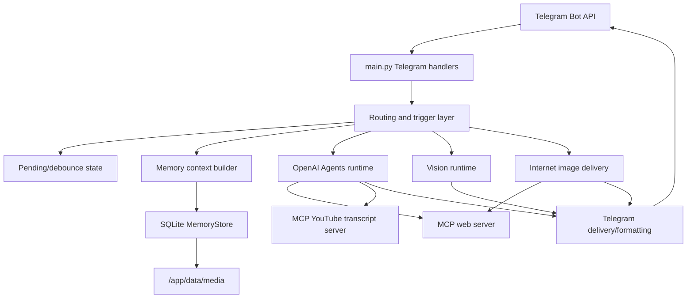
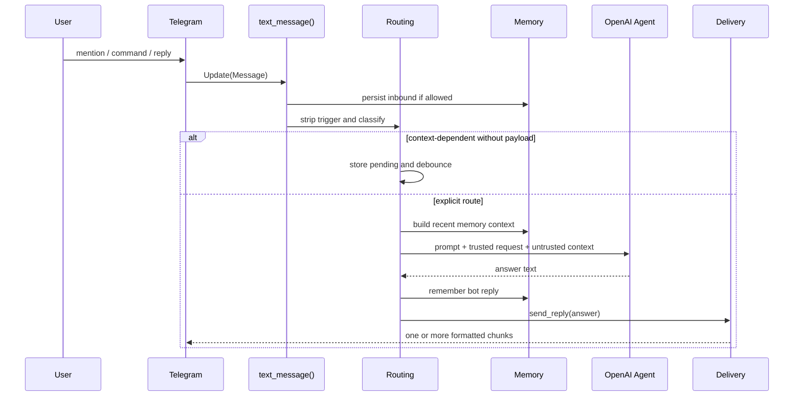
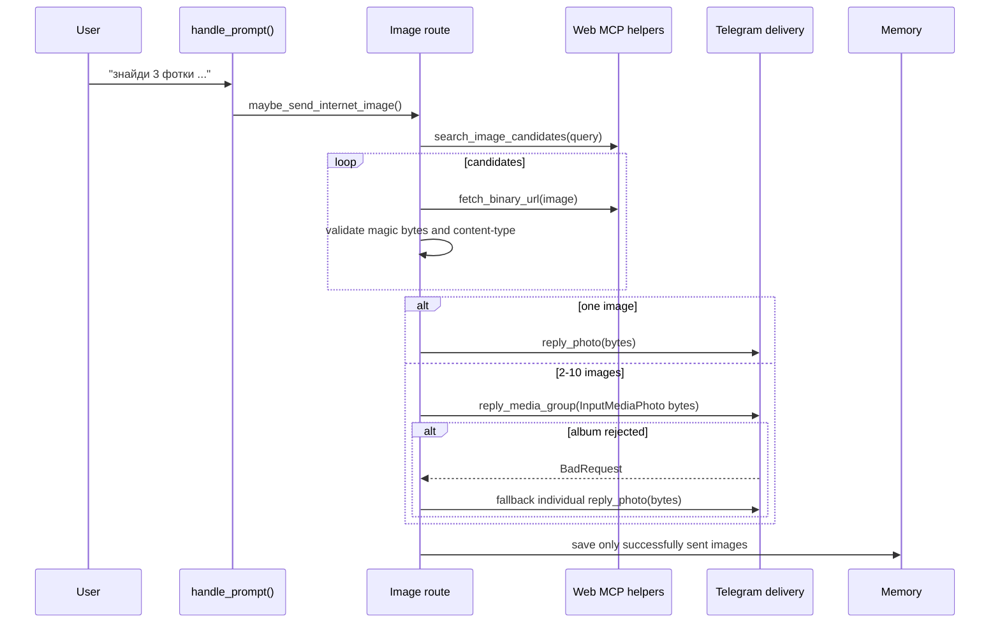
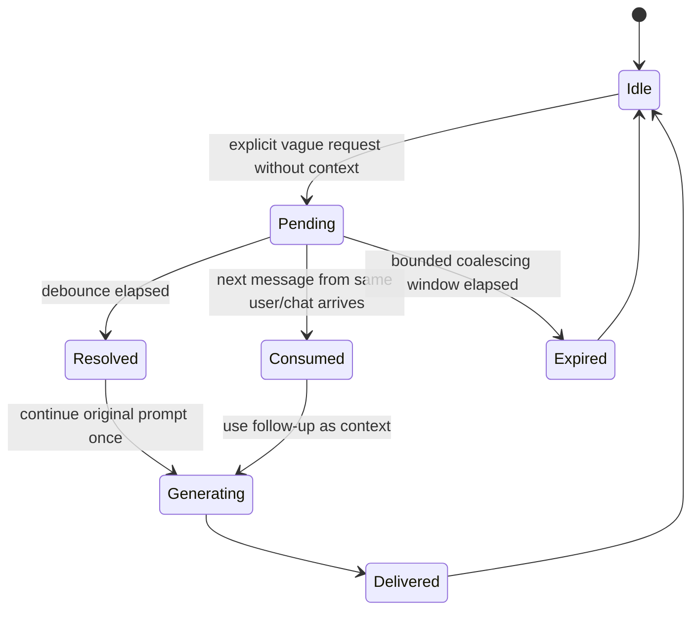
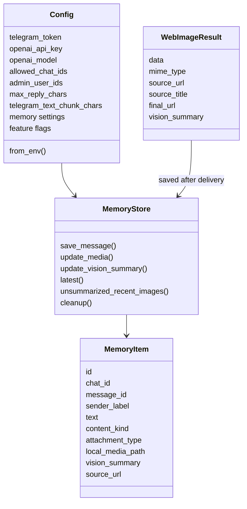

# Aigan Code Audit

Audit baseline: `00827d6 fix: group image results and split long replies`.

## Executive Summary

Aigan is a compact but feature-dense Telegram assistant. It combines Telegram update handling, OpenAI Agents SDK orchestration, MCP web/YouTube tools, persistent SQLite memory, image ingestion, web image delivery, proactive posts, auto-reactions, formatting, and diagnostics.

The project works and has meaningful regression coverage, but its main risk is structural: most production behavior lives in one large `main.py` module. That makes it harder to reason about side effects, route precedence, delivery failures, and future behavior changes. The next high-leverage improvement is not another feature; it is extracting stable layers while keeping tests green.

## Findings

### P1: `main.py` Is a God Module

`main.py` is about 2400 lines and owns config, prompts, Telegram routing, memory ingestion, LLM calls, vision, web image sending, formatting, command handlers, background loops, and app bootstrap.

Risk:
- changes in one feature can silently affect another route;
- tests need large fake Telegram objects because boundaries are not explicit;
- route precedence is hard to audit without reading distant functions;
- import-time side effects make unit tests and tooling more fragile.

Recommended fix:
- split into `config.py`, `telegram_routing.py`, `delivery.py`, `image_delivery.py`, `agent_runtime.py`, and keep `main.py` as bootstrap/wiring only.

### P1: Runtime Objects Are Created at Import Time

`CONFIG`, `MEMORY`, cooldown maps, pending maps, passive contexts, and OpenAI clients are initialized when `main.py` is imported. Tests compensate by setting env vars before import.

Risk:
- importing `main.py` can fail if env is missing;
- tests share global state unless every test clears it;
- future scripts or CLI checks cannot safely import helpers without runtime secrets.

Recommended fix:
- move runtime creation into `create_app(config)` or `RuntimeState`;
- pass state explicitly to handlers or put it in `application.bot_data`.

### P2: Routing Is Functional but Scattered

Routing decisions are spread across trigger parsing, `classify_request()`, pending/debounce logic, image detection, translation route, time-sensitive prefetch, direct image handling, and private-forward behavior.

Risk:
- precedence is implicit and can regress when a new route is added;
- phrase-based regexes are practical but brittle;
- a request can be treated differently depending on where context arrived.

Recommended fix:
- introduce a `RouteDecision` dataclass with fields like `kind`, `prompt`, `has_reference`, `requires_memory`, `requires_web_prefetch`, `delivery_mode`;
- make one routing function produce this object, and make handlers consume it.

### P2: Delivery Is Mixed With Business Logic

Text splitting, Telegram HTML formatting, photo uploads, media groups, fallback sending, memory saving after send, and model response delivery live beside routing logic.

Risk:
- media fallback bugs can affect model response handling;
- text chunking has to be remembered by every outbound path;
- future Telegram behaviors, such as documents or polls, would expand `main.py` further.

Recommended fix:
- extract a `TelegramDelivery` layer with methods `reply_text()`, `send_chat_text()`, `reply_photo()`, `reply_album()`;
- keep all Telegram limit handling in that layer.

### P2: Expected Fallbacks Still Log Stack Traces

Some expected failures, such as invalid candidate photos or Telegram rejecting one candidate, are logged with stack traces. That is useful while developing but noisy in production.

Risk:
- real incidents get buried in expected fallback traces;
- operators may misread normal fallback behavior as a crash.

Recommended fix:
- log expected candidate rejection at `INFO` or `WARNING` without `exc_info`;
- reserve stack traces for unexpected failures or final route failure.

### P2: HTML-Aware Chunking Needs More Hardening

Smart splitting happens before Telegram HTML rendering. Most output is plain text, but if the model emits long allowed HTML, a split can cut through a tag pair and degrade formatting.

Risk:
- user still gets text, but formatting may be broken or escaped strangely;
- fallback behavior can hide the root cause.

Recommended fix:
- keep encouraging plain text in the prompt;
- add tests for long text containing `<b>...</b>`, `<code>...</code>`, and escaped `<`/`&`;
- optionally strip all allowed HTML before chunking, then render per chunk.

### P3: Memory Layer Is Good Enough but Needs Service Boundaries

`memory.py` is small and understandable. The schema is practical: one `messages` table stores text, media metadata, references, source URLs, and vision summaries.

Risk:
- `main.py` decides too much about memory semantics;
- storing bot replies, Telegram messages, and external web images in one table is useful but could become confusing without a typed service layer.

Recommended fix:
- keep `MemoryStore` as storage;
- add a thin `MemoryService` for domain actions: `record_inbound()`, `record_bot_reply()`, `record_web_image()`, `recent_context()`, `ensure_image_summaries()`.

### P3: Tests Are Valuable but Monolithic

`tests/test_regressions.py` covers many important regressions: pending flow, web safety, time metadata, formatting, memory, image sending, routing, changelog/version.

Risk:
- a single giant test file becomes hard to navigate;
- fake Telegram objects will keep growing as features grow.

Recommended fix:
- split into `test_routing.py`, `test_delivery.py`, `test_memory.py`, `test_web_safety.py`, `test_commands.py`;
- keep shared fakes in `tests/fakes.py`.

## Layer Map

## Runtime Sequence: Text Request

## Runtime Sequence: Internet Image Request

## Pending Request State

## Main Domain Types

## Block-by-Block Understanding

### Configuration and Bootstrap

`Config.from_env()` defines all runtime settings: Telegram/OpenAI secrets, model behavior, cooldowns, reply limits, proactive settings, image settings, pending/debounce values, memory settings, and web-image flags.

`main()` wires the Telegram `Application`, command handlers, message handlers, MCP servers, and background lifecycle.

Current quality:
- good: config is centralized and env-driven;
- weak: config and global runtime state are created at import time.

### System Prompt and Contracts

`SYSTEM_PROMPT` contains language, tone, tool-use, source-trust, time, and Telegram-formatting rules.

Current quality:
- good: prompt explicitly marks Telegram/user-provided context as untrusted;
- good: Ukrainian/English/no-Russian policy is clear;
- weak: prompt is long and embedded in code, which makes review and versioning harder.

### Telegram Identity, Triggers, and Allowlist

The bot detects commands, mentions, replies to itself, private forwards, and configured prefix triggers. `should_allow_chat()` and `allow_command()` gate responses by chat/admin rules.

Current quality:
- good: allowlist is enforced for commands and normal messages;
- weak: trigger parsing and route classification are separate enough that precedence requires careful reading.

### Pending/Debounce Flow

Context-dependent prompts like "поясни" can create a pending request. A short debounce waits for a follow-up forward/photo; the longer pending TTL keeps late context usable.

Current quality:
- good: this solves Telegram update ordering quirks;
- weak: pending state is global mutable memory and not persisted across restarts.

### Persistent Memory

Inbound allowed messages and bot replies are stored in SQLite. Images can be cached locally, and missing vision summaries are generated lazily when later prompts need image context.

Current quality:
- good: bounded retention and media cleanup exist;
- good: memory context is explicitly labeled untrusted;
- weak: memory semantics are scattered across `main.py`.

### Agent Runtime

`run_agent()` creates local stdio MCP servers for web and YouTube per request, runs the OpenAI Agent with current-time metadata, then returns final output.

Current quality:
- good: MCP tools are local and purpose-specific;
- weak: starting MCP servers per request is simple but may add latency and overhead.

### Vision Runtime

Current Telegram images and recent cached images are converted to data URLs and sent through `OpenAI.responses.create()` with the configured vision model.

Current quality:
- good: vision summaries are cached in memory;
- weak: image and text paths are parallel rather than unified under one request context object.

### Web and Image MCP

`mcp_servers/web.py` provides safe web search, image search, URL fetch, and binary image fetch. It rejects private/local networks and Russian domains/services.

Current quality:
- good: redirect chains are checked manually;
- good: binary fetch limits content-type and byte size;
- weak: search results are filtered by host but not fully resolved unless later fetched.

### YouTube MCP

`mcp_servers/youtube_transcript.py` extracts video IDs, fetches public captions, and optionally downloads/transcribes audio if enabled.

Current quality:
- good: audio fallback is opt-in and duration-limited;
- weak: downloading/transcribing is expensive and should stay disabled by default.

### Internet Image Delivery

Image requests are detected by regex, searched through safe image candidates, fetched as bytes, magic-byte validated, then delivered as a single photo or media group album. Memory is saved only after successful delivery.

Current quality:
- good: avoids raw URL answers;
- good: validates bytes before Telegram upload;
- good: album fallback exists;
- weak: regex-based intent detection will need steady tuning.

### Text Delivery and Formatting

Text is normalized from leaked Markdown into Telegram HTML, escaped safely, split into chunks, and sent with HTML parse mode. Bad Telegram HTML falls back to plain text.

Current quality:
- good: delivery layer now owns Telegram length limits;
- good: long replies are not silently cut at the first message;
- weak: HTML-aware splitting needs more edge-case tests.

### Diagnostics and Versioning

Commands include `/help`, `/ids`, `/ping`, `/context`, `/version`, and `/proactive_now`. `/version` reads the latest entries from `CHANGELOG.md`.

Current quality:
- good: `/version` makes release notes visible in chat;
- good: `/context` helps inspect persistent memory;
- weak: diagnostic command outputs are not strongly structured.

### Proactive and Auto-Reaction

Proactive messages run on a timed loop when enabled. Auto-reaction is keyword/probability/cooldown based and disabled by default.

Current quality:
- good: conservative defaults;
- weak: proactive behavior shares the same broad agent prompt path, so it depends on memory formatting quality.

### Tests

Regression tests cover routing, pending flow, web safety, time metadata, Telegram formatting, memory, image routing, album fallback, changelog parsing, and version command.

Current quality:
- good: tests are high-signal and close to real regressions already seen in chat;
- weak: one large test file and one large fake message class will become hard to maintain.

## Recommended Refactor Roadmap

1. Extract delivery:
   - `delivery.py`: HTML rendering, text chunking, `send_reply`, `send_chat_text`.
   - `image_delivery.py`: `WebImageResult`, photo/album upload, fallback.

2. Extract routing:
   - `routing.py`: trigger stripping, `RouteDecision`, image/translation/time-sensitive classification.
   - Keep all route precedence in one table-like function.

3. Extract memory service:
   - `memory_service.py`: Telegram-to-memory mapping, image caching, lazy summaries.
   - Keep `memory.py` as storage only.

4. Reduce import-time side effects:
   - create `RuntimeState` containing config, memory, cooldowns, pending state, passive contexts.
   - initialize it in `main()`.

5. Split tests:
   - `tests/fakes.py`;
   - `test_delivery.py`;
   - `test_routing.py`;
   - `test_memory.py`;
   - `test_mcp_web.py`;
   - `test_commands.py`.

## Acceptance Criteria for Future Cleanup

- `main.py` is mostly application wiring and Telegram handler registration.
- Route precedence can be understood from one function or table.
- Delivery tests do not import OpenAI or initialize Telegram runtime.
- Memory tests do not need fake Telegram messages except at service-boundary tests.
- Expected fallbacks do not produce stack traces in normal logs.
- `/version` and changelog remain updated for every release.
