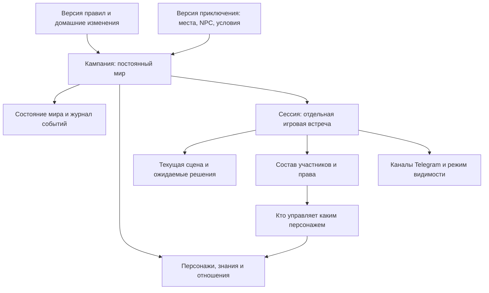
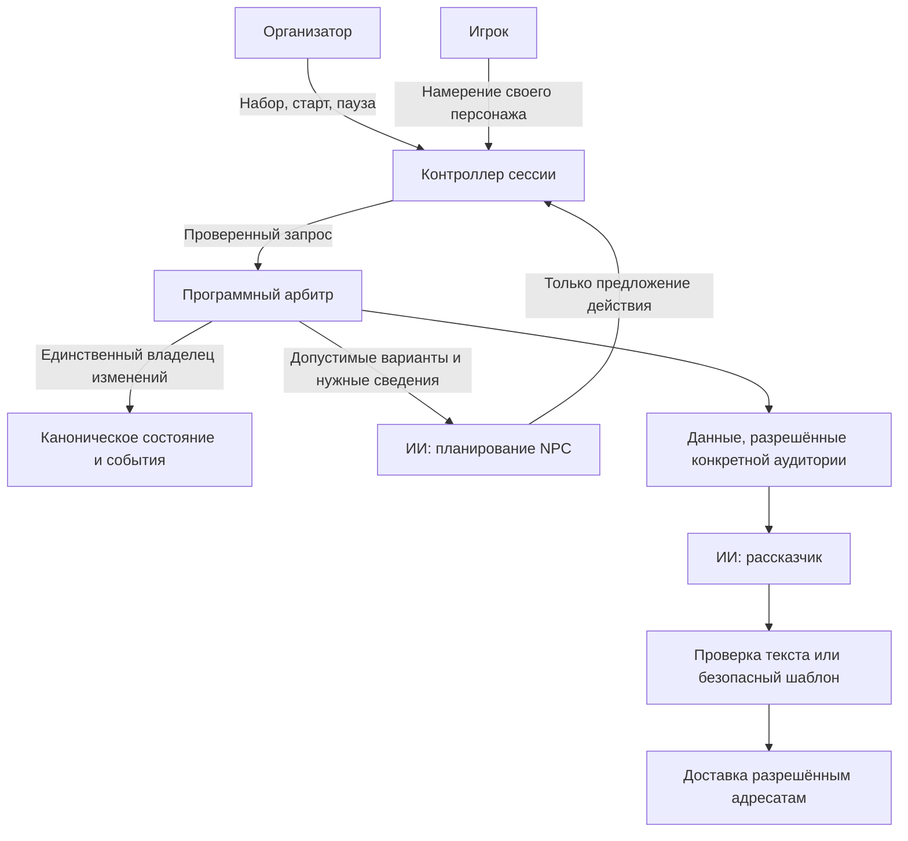
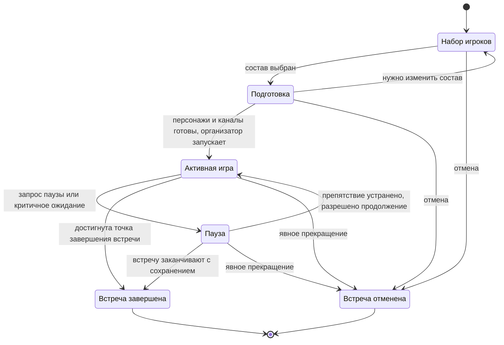
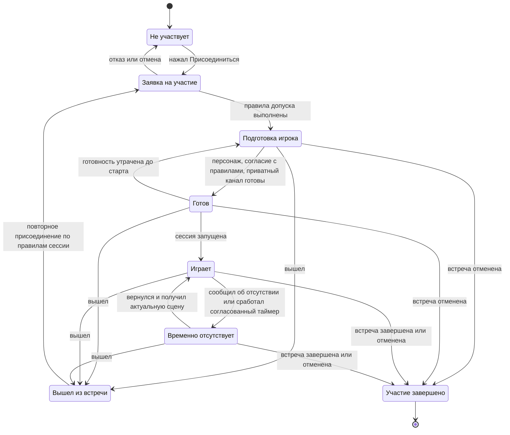
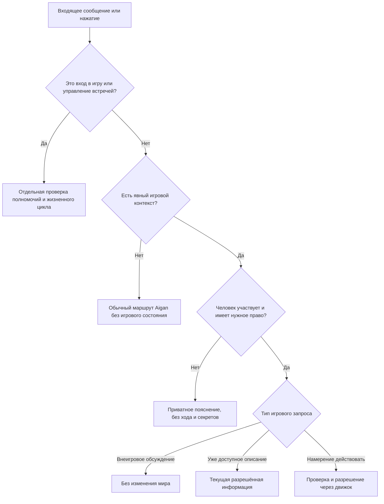
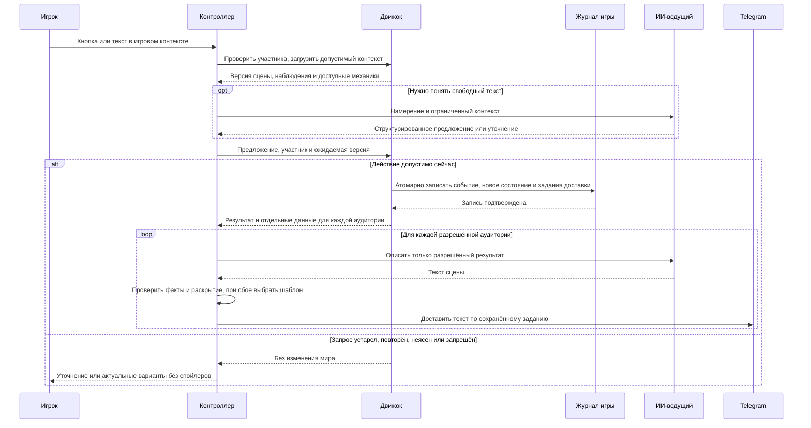
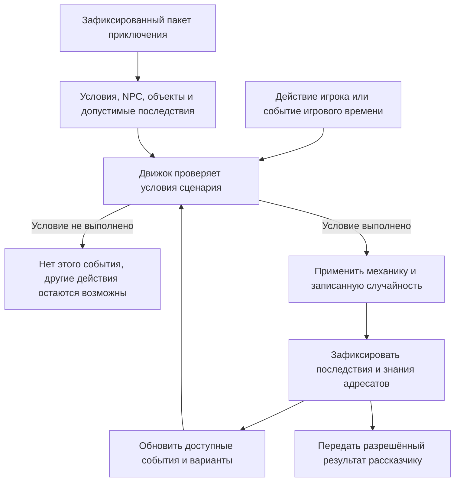
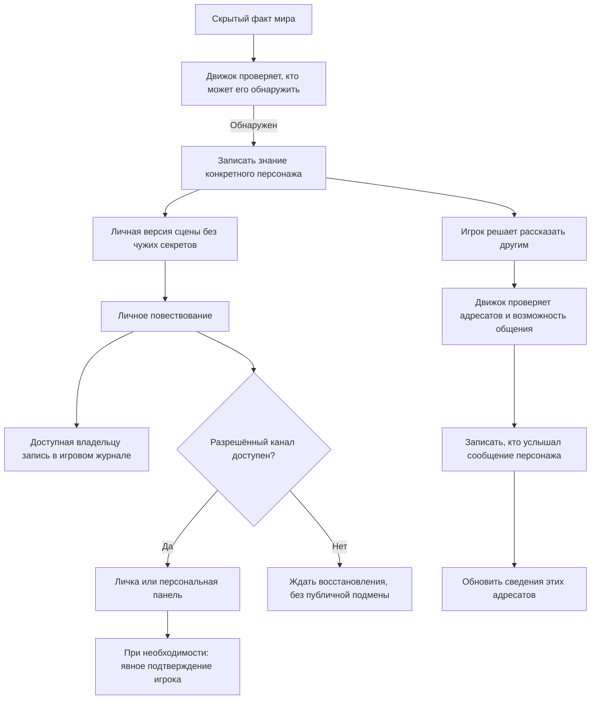
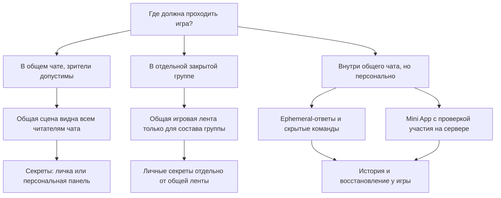

# D&D-oriented game sessions in Telegram

Дата: 2026-09-11. Версия: 0.1. Статус: модель для обсуждения, не реализованная функциональность.

Связанные документы: [план исследования](game-research-plan.md), [стиль повествования](narrative-style.md). Публичная исследовательская задача: [#207](https://github.com/Turkevich91/Aigan/issues/207).

Идеи и вопросы можно оставлять в [обсуждении задачи #207](https://github.com/Turkevich91/Aigan/issues/207). Особенно полезны примеры игровых ситуаций, неудобных переходов, непонятных правил и желаемых способов взаимодействия. Не публикуйте личную переписку или персональные данные участников.

## Основа и границы

D&D — выбранная опора: люди управляют партией персонажей, бот выполняет работу ведущего. Редакция, приключение и поддерживаемый набор механик ещё не выбраны. Исследование, общение и бой соответствуют структуре [официальных правил D&D](https://www.dndbeyond.com/sources/dnd/br-2024/playing-the-game#RhythmofPlay), но полная совместимость не заявляется.

Утверждённое направление: программные правила, изолированный игровой контекст, сохранённый мир, скрытые точные боевые показатели, иммерсивное повествование. Диаграммы ниже предлагают конкретный способ это устроить; переходы и полномочия требуют согласования до реализации.

Скрытые от самого игрока HP — наше домашнее правило. HP в D&D не являются медицинским диагнозом: рассказчик не выводит из их величины переломы или дополнительные штрафы. Пороговые последствия, предусмотренные выбранными правилами, сохраняются, включая потерю сознания или смерть при нулевых HP и эффекты, зависящие от Bloodied. Подтверждённые состояния хранятся отдельно. См. [Hit Points и Conditions](https://www.dndbeyond.com/sources/dnd/br-2024/playing-the-game#HitPoints).

## 1. Кампания, сессия, сцена и персонаж — разные сущности

- Завершение встречи не удаляет кампанию. Следующая встреча продолжает сохранённый мир.
- Сессия фиксирует версии правил и сценария. Изменение правил во время активной игры запрещено; миграция между встречами — отдельное явное решение.
- Для первого прототипа предлагается одна активная сессия на кампанию. Параллельные независимые кампании изолированы.
- Статус сессии, режим сцены, присутствие человека, состояние персонажа и доступность доставки — независимые оси.

## 2. Бот-ведущий: полномочия разделены

| Роль | Разрешено | Не разрешено автоматически |
| --- | --- | --- |
| Организатор | Собрать партию, управлять встречей | Читать тайны ведущего, менять HP и исходы |
| Игрок | Управлять закреплённым персонажем, выбирать доступные действия | Управлять чужим персонажем, смотреть чужие секреты |
| Зритель, если разрешён | Получать зрительскую версию событий | Делать ходы или читать личные сведения |
| Обычный участник чата | Продолжать обычное общение | Считаться игроком без присоединения |
| Программный арбитр | Проверять правила, вычислять, фиксировать события | Выдавать скрытые сведения неразрешённой аудитории |
| ИИ-ведущий | Интерпретировать намерения, предлагать допустимые действия NPC, описывать разрешённое | Самостоятельно записывать результат или менять правила |

Администратор Telegram и организатор игры — разные роли. Транспортные права бота также не дают человеку игровых полномочий. Организатор может одновременно быть игроком; роли складываются явно.

Планирование NPC и публичное повествование используют разные ограниченные контексты. Рассказчику нельзя передавать полную секретную запись ведущего с просьбой просто не разглашать её. Диаграмма показывает границы полномочий, а не требование использовать несколько моделей.

## 3. Жизненный цикл встречи

Пауза сохраняет версию состояния, инициативу, реакции, ожидаемые решения и оставшееся время. Мир по умолчанию не движется от реальных часов; сроки и поведение отсутствующих игроков согласуются заранее. Пауза вступает в силу на границе атомарного действия: уже зафиксированный результат не откатывается. Отмена также не стирает события.

Внутри активной встречи возможны исследование, разговор, бой и отдых. Бой использует инициативу, ход и разрешённые окна реакций. Исследование и разговор не обязаны идти по боевой очереди: порядок разрешения конфликтующих действий задаётся отдельно. Отдых — действие мира, пауза — остановка встречи.

## 4. Как человек становится игроком

Участие определяется записью в сессии, связанной с Telegram user ID, а не именем, username, наличием в группе или тем, что человек написал что-то после начала игры. Роль участника и его присутствие проверяются отдельно.

Для первого варианта предлагается закрывать набор на время активной сцены; позднее присоединение разрешать на безопасной границе. Потеря личного канала меняет готовность доставки, но не удаляет человека из партии. Отсутствие человека не меняет здоровье персонажа; потеря сознания персонажа не исключает человека из игры.

## 5. Что считать ходом, а что обычной перепиской

Явный контекст: кнопка игры, ответ на её карточку, игровая команда или выбранная игровая сессия в личном интерфейсе. Для лички тоже нужен явный выбор: личный разговор с Aigan не становится игрой автоматически. Запросы и кнопки привязаны к сессии, сцене, участнику и версии состояния.

Команды нужны преимущественно для входа и управления; сами ходы могут быть кнопками или свободным текстом. Нажатие «Своё действие» открывает привязанный к игроку запрос. Текст «пытаюсь открыть дверь» — предложение действия, не подтверждённый успех. Неоднозначное намерение уточняется. Неподдерживаемая механика не заменяется выдуманным исходом.

Чтение уже известных сведений не требует нового хода. Поиск новой улики, осмотр с затратой времени или проверкой навыка — потенциально меняющее состояние действие, даже если игрок называет это вопросом.

В общей группе одна лишь регистрация игрока не позволяет перехватывать весь его текст. В отдельной игровой группе можно согласовать более свободный режим. Игровые данные не попадают в обычные профили, поиск, напоминания и долговременную социальную память Aigan.

## 6. Полный цикл действия

Одновременные действия разрешаются последовательно либо согласованной фазой. Повторный callback не тратит ресурс повторно. Реакции и NPC проходят тот же арбитр. Повтор отправки в Telegram не вызывает повторный бросок или действие.

Отказ рассказчика после записи события не отменяет механику: возможен безопасный шаблон или отложенная доставка. Подтверждение события само по себе не доказывает достоверность каждого предложения свободной прозы; пределы проверок и тесты на утечки остаются частью исследования.

## 7. Сценарий — правила событий, а не обязательный сюжетный коридор

Пакет приключения задаёт исходное положение, цели NPC, условия открытия сведений, проверки и возможные последствия. Движок фиксирует факт срабатывания и не выполняет одноразовый эффект повторно. Цепочки триггеров ограничены, чтобы избежать бесконечного цикла. Сообщения игроков не исполняются как программный код.

Например, запечатанная дверь может быть открыта ключом, допустимой магией или поддерживаемой проверкой инструментов. Это несколько способов изменить один мир, а не просьба к модели выбрать красивую концовку. Новый нестандартный способ требует поддерживаемого правила или уточнения до исхода.

Мир воспроизводится по версии правил, исходному состоянию, принятым действиям и записанным случайным результатам. Выбранные моделью действия NPC также записываются. Идентичная формулировка художественного текста не является условием детерминированности механики.

## 8. Секрет, знание персонажа и доставка человеку

Истина мира, знания/убеждения персонажей и осведомлённость человека не тождественны. NPC может ошибаться или лгать. Фраза персонажа становится фактом сообщения, а не автоматически доказанной истиной. Общее описание получает только допустимое для всей выбранной аудитории; разделившаяся партия не слышит всё происходящее повсюду.

Доступ к уже обнаруженному секрету сохраняется в журнале независимо от временной панели. Успешный ответ API не доказывает, что человек прочитал текст. Критичный выбор может ждать явного подтверждения; отключённая личка никогда не приводит к публикации секрета в общей группе.

## 9. Что именно можно скрыть в Telegram

Telegram позволяет персональные ephemeral-сообщения в группе и скрытые команды. Отправка адресуется одному человеку. Без административных прав ответ возможен в течение 15 секунд после подходящего callback или входящего ephemeral-сообщения; с правами администратора возможна отправка без этого действия. Доставка не гарантирована, сообщения могут исчезнуть. Персональная замена карточки поддерживается через `replace_callback_query_message`. См. [контракт ephemeral](https://core.telegram.org/bots/api#ephemeral-messages-and-commands) и [параметры](https://core.telegram.org/bots/api#ephemeralmessageparameters).

Это позволяет спроектировать скрытый игровой слой, но не создаёт постоянный закрытый подчат партии. Приложение само распределяет персональные версии, хранит историю и проверяет участие. Обычный текст человека в общей ленте от этого не скрывается. Для полностью скрытого режима и обсуждения, и действия должны проходить через личный ввод, скрытые команды или Mini App. Возможность человека пересказать или сфотографировать секрет не устраняется.

| Инструмент | Предлагаемое применение | Граница |
| --- | --- | --- |
| Inline-кнопки | Присоединиться, действовать, открыть персонажа | Нажатие не публикует текстовый ход; полномочия проверяет сервер |
| Команды | Вход, пауза, выход, восстановление сцены | Список команд не является контролем доступа |
| Ответ на карточку | Свободное описание намерения | Обычный ответ в группе виден её читателям |
| Личка бота | Секреты и личный журнал | Сначала игрок запускает бота или даёт право писать |
| Ephemeral-панель | Личное наблюдение прямо в группе | Временный интерфейс, не единственная копия сведений |
| Тема форума | Отделить игру от бытовой переписки | Не закрытая комната для выбранных игроков |
| Mini App | Карта, досье, журнал, сложный выбор | Нужно собственное разграничение доступа на сервере |
| Опрос | Обсуждение предпочтений партии | Применение результата всё равно проверяет игра |

Кнопки и команды описаны в [Bot Features](https://core.telegram.org/bots/features#inputs). Для лички базовый вход — Start, см. [ограничения ботов](https://core.telegram.org/bots#how-are-bots-different-from-users); Mini App также может запросить право писать пользователю. Общая ссылка на Mini App поддерживает совместное использование, но его входные данные нужно проверять: [Mini Apps](https://core.telegram.org/bots/webapps#validating-data-received-via-the-mini-app).

[Темы](https://core.telegram.org/api/forum) организуют сообщения, а [спойлер](https://telegram.org/blog/reactions-spoilers-translations#spoilers) скрывает текст только до нажатия. [Privacy Mode](https://core.telegram.org/bots/features#privacy-mode) управляет тем, что получает бот, а не доступом людей к его ответам.

Программную поддержку ephemeral и поведение реальных клиентов ещё нужно проверить отдельно. Документация платформы не доказывает готовность установленной библиотеки или текущего бота. Медленная генерация не должна предполагать, что окно ephemeral-ответа всё ещё открыто: нужны восстановление по кнопке и согласованный резервный приватный канал.

## Предлагаемая первая проверка и открытые решения

Для первого прототипа предлагается отдельная игровая группа и лички: это оставляет живое обсуждение партии обычным Telegram-разговором. Персональный слой внутри бытового чата — отдельный эксперимент, если именно совместное пространство важно. Это рекомендация, не уже выбранный режим.

До реализации согласовать:

- Редакцию D&D, домашние изменения и ограниченный набор механик первого приключения.
- Число игроков, формат встреч, длительность, правила отсутствия и тайм-аутов.
- Режим видимости: зрители в общем чате, закрытая группа или персональный слой.
- Какие знания доступны зрителям и как устроено общение разделившейся партии.
- Права организатора, порядок паузы и позднего присоединения.
- Представление ресурсов без точных боевых чисел; не скрывать последствия выбора до потери осмысленности игры.
- Резервный приватный канал, подтверждение критичных сведений и восстановление после сбоя.

Минимальные проверки модели: неигрок нажимает кнопку; игрок говорит вне игры; два игрока берут один предмет; повторяется callback; игрок блокирует личку; исчезает ephemeral-панель; секрет известен только одному персонажу; NPC сообщает ложь; игрок отсутствует; персонаж теряет сознание; встреча продолжается после перезапуска. Ни один случай не должен менять правила, дублировать результат, раскрывать чужой секрет или загрязнять обычную память.

Документ уточняет R2, R3, R4 и R6 плана; он не закрывает их исследовательские проверки и не разрешает запуск игры, реализацию или развёртывание.
