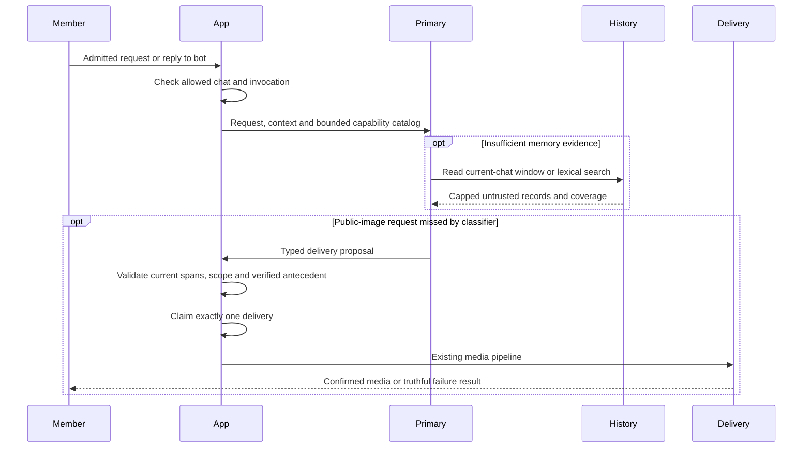
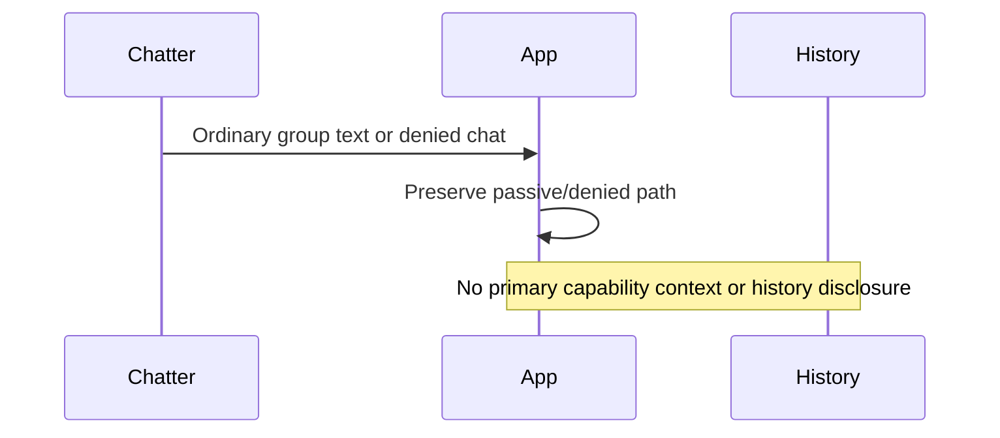

# Primary-agent capabilities

The primary model can use the same bounded capability catalog for admitted text, translation and interactive-image requests, including when initial classification misses the user's request. `PRIMARY_CAPABILITY_RECOVERY_ENABLED` defaults to `false`. Disabling it restores the previous routing and agent-tool set; it does not change existing media settings or model assignments.

## Standard tools on admitted turns

The catalog includes `search_web`, `fetch_url`, `get_youtube_transcript`, bounded `read_chat_history`, `read_conversation_branch` and `inspect_chat_image`, and `request_image_delivery` when public-image delivery is enabled. Scope, retained-history cutoff and feature availability still determine which capabilities can be constructed. Classifier labels do not grant permission, and a soft classifier refusal can be reconsidered by the primary model even when image delivery is disabled.

Interactive images enter the existing Agents SDK loop as image input alongside the current request. They retain the configured interactive-vision model and reasoning effort, the six-turn limit, and the 120-second agent timeout. Attaching tools does not require a separate preliminary model call. Simple descriptions can finish directly. Background neutral descriptions keep their existing direct vision path. Disabling capability recovery retains the legacy interactive-vision fallback.

Translation sources and referenced/forwarded content remain untrusted evidence. They do not authorize image delivery or change the current recipient. Image proposals still require current-request grounding and a single claimed host dispatch, and success claims still require confirmed outcomes. Reminder mutations retain their separate current routing and authorization checks; this change does not expose unrestricted write tools.

Tool availability is a tested application property; it is not a guarantee that every model chooses the right tool. Automated regressions exercise the real SDK loop with synthetic provider/tool responses and isolated memory, including one-response delivery, source descriptions, denied operations and passive group chatter.

## Retained images in a continuing discussion

When an admitted message replies to a previous answer, the primary agent receives candidate source images from stored same-chat reply and delivery-provenance links, up to six hops. The `inspect_chat_image` tool opens a selected retained original as actual image content inside the same SDK run. Images already exposed by bounded history or preloaded context can also be selected. Descriptions and historical text do not mean the model has inspected the pixels.

Inspection is on demand, with at most three unique images in one run. It does not attach every recent picture to every request, invoke a separate vision model, fetch arbitrary files or URLs, or send an image to Telegram. The tool uses existing cached bytes and enforces source identity, chat/time scope, allowed media roots, image validity and byte limits. It does not replace a missing source with a nearby unrelated picture. Missing or unavailable cached media produces a bounded explanation; the current slice does not download it again.

Source pictures and their text remain untrusted evidence. Viewing them does not authorize commands contained inside them. Source descriptions, ownership, delivery guards, model roles and the existing SDK run limits remain unchanged. Runs offering retained-image inspection use metadata-only SDK tracing so image content is not copied into trace payloads; inspection is unavailable if SDK or provider-client debug payload logging is unsafe.

## Ownership and scope

`chat_history.py` owns request-local retrieval budgets over `MemoryStore.bounded_history_rows`. `retained_images.py` owns cache-only source selection, validation and per-run image-read limits. `image_capability.py` owns bounded image proposal validation and one execution claim. `agent_capabilities.py` exposes thin SDK function adapters. Telegram admission, actual reply/provenance resolution, and dispatch remain in `main.py`. The existing image pipeline owns searching, image review, sending, ambiguous outcomes and persistence.

The model can request a capability. It cannot choose the chat, execution identity, recipient, database, arbitrary tool name or private-media source. Existing invocation admission and feature settings remain application-owned. Classifier labels can be reconsidered by the primary model; they are not an additional permission source.

| Actor/path | History | Image recovery | Enforcement |
| --- | --- | --- | --- |
| Admitted member of an allowed group | Current group's retained messages | New public-web delivery in current group | Invocation gate, fixed chat/cutoff, typed proposal, host delivery |
| Admitted private-chat participant | Current DM only | Current DM only | Existing allowlist and fixed chat |
| Another participant replying to a public album | Same group evidence | May continue the verified public request | Actual reply and successful delivery provenance; prior author need not match |
| Ordinary uninvoked group chatter | No agent tool call | No delivery | Passive ingress path |
| Denied chat or bot-authored invocation | No capability context | No capability context | Existing admission plus context construction guard |
| Model-supplied foreign anchor or participant override | No foreign-chat rows; participant only narrows current chat | No recipient parameter | SQL scope and adapter validation |

```mermaid
sequenceDiagram
    participant Member
    participant App
    participant Primary
    participant History
    participant Delivery
    Member->>App: Admitted request or reply to bot
    App->>App: Check allowed chat and invocation
    App->>Primary: Request, context and bounded capability catalog
    opt Insufficient memory evidence
        Primary->>History: Read current-chat window or lexical search
        History-->>Primary: Capped untrusted records and coverage
    end
    opt Public-image request missed by classifier
        Primary->>App: Typed delivery proposal
        App->>App: Validate current spans, scope and verified antecedent
        App->>App: Claim exactly one delivery
        App->>Delivery: Existing media pipeline
        Delivery-->>Member: Confirmed media or truthful failure result
    end
```

```mermaid
sequenceDiagram
    participant Chatter
    participant App
    participant History
    Chatter->>App: Ordinary group text or denied chat
    App->>App: Preserve passive/denied path
    Note over App,History: No primary capability context or history disclosure
```

## History contract

`read_chat_history` offers `recent`, lexical `search`, and `around` a memory evidence id. Optional participant and ISO date/time filters only narrow the current chat. Search works without embeddings and preserves bot answers, authored invocations and separately labeled quoted/forwarded source material. A fixed target mode is available for separately authorized authored-only analysis; it excludes source material and other authors.

Hard ceilings are 20 messages per call, 1,000 serialized characters per row, 12,000 characters per response, four reads and 30,000 returned characters per model run. SQL reads bounded pages and projects only bounded safe fields. Concurrent tool calls reserve their budget before awaiting retrieval. The persisted current-request row and future messages are excluded. Results expose truncation and selected date coverage; no match does not prove absence from the full conversation. Date-only filters use UTC; precise local-day questions should supply timezone-bearing timestamps.

The current store has no forum-topic field. Retrieval is chat-scoped, not a claim of topic-scoped storage. No media bytes, paths, file tokens, raw notes or system logs are returned.

## Image continuation contract

An admitted primary run receives the typed image request tool when public-image search is enabled. Soft classifier clarification/unavailable responses can reach that run. Supported direct image-delivery routes retain their existing fast path; interactive referenced visual analysis uses the tool-enabled primary loop when capability recovery is enabled.

For a contextual continuation, the application resolves the actual same-chat replied message through successful public-image delivery provenance to authored source requests. It follows at most four ordered delivery/request links and exposes at most 2,500 source-request characters. The model selects unchanged subject words from that evidence and a replacement modifier from the current request. For the synthetic sequence `red flowers` then `yellow ones`, the query uses `flowers yellow`. Unspecified plural inherits the latest confirmed album count; explicit counts and the existing five-image delivery ceiling remain.

History provides grounding, not fresh authority to act. Quoted, negated and unsupported private/external operations remain excluded. The model's semantic selection is checked against literal current and antecedent spans; no cheaper classifier is asked to veto it again. Proposals are bounded to three attempts, with one accepted plan and one locked execution claim. A rejected proposal returns to the model for clarification. An accepted proposal ends that SDK run before generic final prose, then the host dispatches the existing media pipeline once.

A failed or ambiguous delivery does not reopen the claim. A post-claim exception reports uncertainty without inviting a duplicate retry. Tool history, usage and hooks stay in one SDK run; no recursive model restart or prompt-only replay is used.

## Verification and limits

Automated tests cover source scope, exact row/text/call bounds, concurrent reservation, Unicode search without embeddings, multi-participant and multi-hop album replies, real SDK tool-output continuity, rejected proposal continuation, once-only host dispatch and ambiguous delivery. Provider-backed synthetic probes and their measured outcomes are recorded separately when completed. These checks do not mark the operator's manual Telegram field quests complete.

No model role, embedding dimension, active tier routing, database schema or live index is changed by this feature. Character analysis and Telegram burst assembly are separately tracked follow-ups.
